# ComicPedia - AI 漫画生成器

## 变更记录 (Changelog)

| 时间 | 操作 | 说明 |
|------|------|------|
| 2026-04-08 23:29:02 | 增量扫描 | 修复 `/api/tasks` 删除/分页边界、Result 页 `viewMode` effect 警告、`imageGen`/`vlm` 出图落盘先后顺序；新增 `resultViewMode.test.ts` 与 `phasePersistence.test.ts`；全量 `test/lint/build` 已验证 |
| 2026-04-08 22:39:03 | 增量扫描 | 修复 Result 页 durable queue 配置透传、单面板重绘持久化竞态、`useTaskSubscription` 临时空读停轮询；测试文件更新为 71 个；相关定向回归 63/63 通过 |
| 2026-04-07 21:40:19 | 增量扫描 | 全仓清点确认结构稳定：12 页面、32 API 路由、91 组件、12 hooks、70 测试文件；新增 3个模块结构图节点（llm、export、phases）；lib文件总数 91；模块级CLAUDE.md 覆盖 14 个目录 |
| 2026-04-06 15:02:08 | 增量扫描 | 重新全仓清点；新增 `src/app/CLAUDE.md`；更新 hooks 为 12 个、测试文件为 70 个；补充`useTaskPageLifecycle`、`useUIMode`、generation presets、relations 页面与 durable orchestration 覆盖摘要 |
| 2026-04-06 | 增量扫描 | 新增 directorAgent（导演助手）、角色关系图谱、taskOrchestrator（持久化编排）、relations API 等模块；测试文件更新为 69 个；更新模块索引与结构图 |
| 2026-04-05 | 发版同步 | `dev` 已完成 durable orchestration、accuracy loop、visual diagnosis、角色关系图谱与体验改版；API 路由更新为 32 个，tracked 测试文件更新为 62 个 |
| 2026-04-02 | 增量扫描 | 新增准确性闭环、VLM 视觉诊断/修复、导演大纲、脚本校验/修复、Wikipedia 代理、模型发现、ComfyUI 等模块文档 |
| 2026-03-27 | 交付流程 | 新增 GitHub Actions CI 与 `pnpm ship:check` 本地发版检查 |
| 2026-03-17 | 初始化扫描 | 首次全仓扫描，生成架构文档 |

---

## 项目愿景

ComicPedia 是一个 AI 驱动的漫画生成器。它把百科/科普/诗词/小说/小红书文本转换成结构化分镜脚本，再串联图片生成、视觉复审、知识测验、关系图谱与导出能力，形成完整的创作与审阅工作流。

当前主技术栈：Next.js 15 App Router、React 19、TypeScript strict mode、Tailwind CSS 3、Zustand、IndexedDB、better-sqlite3。

---

## 架构总览

```text
Browser UI
  -> hooks + Zustand + IndexedDB
  -> /api/tasks + /api/tasks/[id]/actions
  -> Server Runtime (SQLite / image storage / wikipedia / taskOrchestrator)
  -> External LLM / Image / Wikipedia / Accuracy Providers / ComfyUI
```

### 核心分层

| 层 | 位置 | 职责 |
|----|------|------|
| UI / Page | `src/app`, `src/components`, `src/hooks` | 表单、结果页、关系图谱、设置与导航 |
| Client Runtime | `src/lib/client` | 发起任务、管理本地缓存、局部编辑与兼容逻辑 |
| Server Runtime | `src/lib/server` | SQLite、图片存储、Wikipedia、服务端图片生成 |
| Durable Orchestration | `src/lib/server/taskOrchestrator` | 脚本/图片/深度复审队列与恢复 |
| Domain Libs | `src/lib`, `src/prompts` | accuracy、VLM、质量链、directorAgent、prompt 模板 |

---

## 模块结构图

```mermaid
graph TD
    ROOT["(根) ComicPedia"] --> APP["src/app"]
    ROOT --> COMP["src/components"]
    ROOT --> HOOKS["src/hooks"]
    ROOT --> STORES["src/stores"]
    ROOT --> PROMPTS["src/prompts"]
    ROOT --> CLIENT["src/lib/client"]
    ROOT --> SERVER["src/lib/server"]
    ROOT --> ACC["src/lib/accuracy"]
    ROOT --> DIRAGENT["src/lib/directorAgent"]
    ROOT --> LLM["src/lib/llm"]
    ROOT --> EXPORT["src/lib/export"]
    SERVER --> ORCH["src/lib/server/taskOrchestrator"]
    CLIENT --> PHASES["src/lib/client/phases"]

    click APP "./src/app/CLAUDE.md" "查看 app 模块文档"
    click COMP "./src/components/CLAUDE.md" "查看 components 模块文档"
    click HOOKS "./src/hooks/CLAUDE.md" "查看 hooks 模块文档"
    click STORES "./src/stores/CLAUDE.md" "查看 stores 模块文档"
    click PROMPTS "./src/prompts/CLAUDE.md" "查看 prompts 模块文档"
    click CLIENT "./src/lib/client/CLAUDE.md" "查看 client 模块文档"
    click SERVER "./src/lib/server/CLAUDE.md" "查看 server 模块文档"
    click ACC "./src/lib/accuracy/CLAUDE.md" "查看 accuracy 模块文档"
    click DIRAGENT "./src/lib/directorAgent/CLAUDE.md" "查看 directorAgent 模块文档"
    click ORCH "./src/lib/server/taskOrchestrator/CLAUDE.md" "查看 taskOrchestrator 模块文档"
    click LLM "./src/lib/llm/CLAUDE.md" "查看 llm 模块文档"
    click EXPORT "./src/lib/export/CLAUDE.md" "查看 export 模块文档"
    click PHASES "./src/lib/client/phases/CLAUDE.md" "查看phases 模块文档"
```



---

## 模块索引

| 路径 | 职责 | 关键文件 |
|------|------|----------|
| `src/app/` | 12 页面 + 32 API 路由的 App Router 外壳 | `layout.tsx`, `page.tsx`, `api/tasks/route.ts`, `result/[id]/page.tsx` |
| `src/components/` | 约 96 个 UI 组件（含 7 个子目录） | `ScienceForm.tsx`, `WikipediaForm.tsx`, `result/VisualDiagnosisWorkbench.tsx`, `characters/RelationGraph.tsx` |
| `src/hooks/` | 12 个自定义 hook | `useContentForm.ts`, `useTaskActions.ts`, `useTaskSubscription.ts`, `useTaskPageLifecycle.ts`, `useUIMode.ts` |
| `src/stores/` | Zustand 内存态 | `taskStore.ts`, `listCache.ts` |
| `src/lib/client/` | 浏览器生成运行时与 phase 拆分 | `generator.ts`, `taskLifecycle.ts`, `db.ts`, `eventBus.ts`, `phases/*` |
| `src/lib/server/` | SQLite、图片、Wikipedia、服务端图片生成 | `db.ts`, `imageExtractor.ts`, `imageStorage.ts`, `wikipedia.ts`, `comfyuiClient.ts` |
| `src/lib/server/taskOrchestrator/` | durable queue、恢复、pause/resume/reconcile | `runtime.ts`, `scriptRunner.ts`, `imageRunner.ts`, `reviewRunner.ts`, `replay.ts`, `reconcile.ts` |
| `src/lib/accuracy/` | research -> claimReview -> repair 闭环 | `research.ts`, `claimReview.ts`, `repair.ts` |
| `src/lib/directorAgent/` | 叙事/节奏/分镜建议分析 | `index.ts`, `suggestionGenerator.ts`, `analyzer/*` |
| `src/prompts/` | 五类 Prompt 模板 | `scriptGenerator.ts`, `wikipediaGenerator.ts`, `poetryGenerator.ts`, `novelGenerator.ts`, `xhsGenerator.ts` |
| `src/lib/llm/` | LLM 客户端、解析器、角色生成 | `client.ts`, `parsers.ts`, `characterGen.ts` |
| `src/lib/export/` | 多格式导出（PDF/ZIP/XHS/Markdown/Seedance） | `pdf.ts`, `zip.ts`, `xhs.ts`, `markdown.ts`, `seedance.ts`,`image.ts` |
| `src/lib/client/phases/` | 客户端生成流程各阶段 | `script.ts`, `imageGen.ts`, `vlm.ts`, `research.ts`, `quality.ts` |
| `src/lib/` | 共享工具库、VLM、质量链、类型 | `types.ts`, `llm.ts`, `vlmScorer.ts`, `qualityScore.ts`, `generationPresets.ts` |
| `src/__tests__/` | 当前 71 个测试文件（含 directorAgent 子目录 5 个） | `taskLifecycle.test.ts`, `panelManager.test.ts`, `accuracyResearch.test.ts`, `imageQueueRunner.test.ts`, `directorAgent/*.test.ts` |

---

## 运行与开发

### 常用命令

```bash
pnpm install
pnpm dev
pnpm test
pnpm test:coverage
pnpm lint
pnpm build
pnpm ship:check
pnpm smoke:accuracy
```

### 运行特征

- Next.js `output: "standalone"`
- `better-sqlite3` 作为服务端原生依赖
- SHOWCASE 模式会把首页跳到 `/gallery`
- `generationPresets.ts` 统一管理 pauseAfterScript、并发度、校准与离页策略

---

## 测试策略

### 当前扫描结果

- 测试文件：70
- 已直接覆盖模块较强：accuracy、task orchestrator、VLM diagnosis、directorAgent、task actions、history/navigation
- 仍偏弱：多数 API route、client facade、stores、export 子模块、Wikipedia/ComfyUI 边界

### 建议优先补测

1. `src/app/api/accuracy/*`, `src/app/api/wikipedia/route.ts`, `src/app/api/comfyui/route.ts`, `src/app/api/relations/*`
2. `src/lib/server/imageExtractor.ts`, `src/lib/server/comfyuiClient.ts`, `src/lib/server/imageGenerationService.ts`
3. `src/lib/client/generator.ts`, `src/lib/client/eventBus.ts`, `src/lib/client/db.ts`
4. 结果页与角色关系图的 E2E/交互回归测试

---

## 编码规范

- TypeScript strict mode
- Next.js App Router，页面/路由分置于 `src/app`
- 客户端与服务端边界严格分离：`src/lib/client` 不得引用 `src/lib/server`
- 图片引用三态要区分：base64 / `file://key` / `/api/images/key`
- 所有外部模型调用应经代理/API 层接入，不在浏览器直接请求第三方

---

## Task State Authority Contract

- `pending` / `scripting` / `generating` -> `client_local`
- `created` / `research_running` / `script_running` / `script_ready` / `calibrating` / `image_queue_running` / `image_queue_paused` / `deep_review_running` / `deep_review_paused` -> `server_durable`
- `completed` / `failed` -> `settled`

Rules:

1. `client_local` 状态优先读 Zustand / IndexedDB 临时态，不用 SQLite 回写覆盖。
2. `server_durable` 状态优先读 `/api/tasks/:id`，页面离开和恢复只按 durable queue 规则处理。
3. 新增任务状态时，必须先更新 `src/lib/taskStateAuthority.ts`，再改调用方。

---

## AI 使用指引

1. 改任务流前先理解 `GenerateTask`、`GenerationPresetSnapshot` 与 `task_jobs`
2. 改结果页前同时查看 `useTaskSubscription`、`useTaskActions`、`useTaskPageLifecycle`
3. 改图片存储前先看 `imageExtractor.ts` 与 `imageStorage.ts`
4. 改 durable queue 前优先检查 `replay.ts`、`imageRunner.ts`、`reconcile.ts`
5. 改 accuracy / VLM / directorAgent 时要保持其前后契约稳定

---

## 扫描备注

本次扫描遵循 `.gitignore` 与默认忽略规则，跳过了：

- `node_modules/`, `.next/`, `.git/`
- `.claude/worktrees/` 中的代理工作树与其依赖
- `data/` 运行时数据库/图片
- `public/output/` 中的生成图片样本
- 二进制图片文件只记录路径，不读内容
