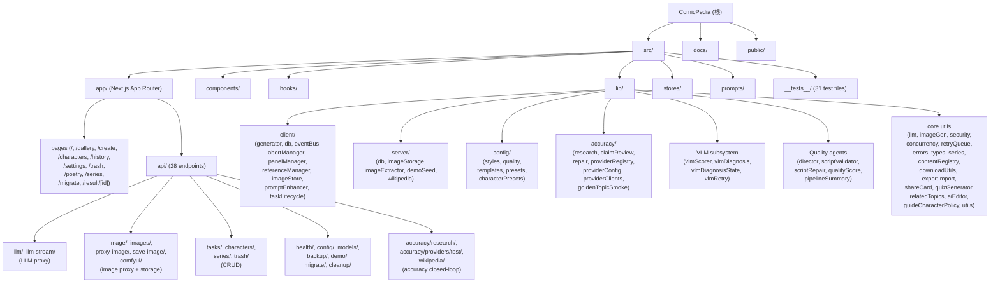

# ComicPedia - AI 漫画生成器

## 变更记录 (Changelog)

| 时间 | 操作 | 说明 |
|------|------|------|
| 2026-04-02 | 增量扫描 | 新增准确性闭环、VLM 视觉诊断/修复、导演大纲、脚本校验/修复、Wikipedia 代理、模型发现、ComfyUI 等模块文档；API 路由从 23 增至 28；测试文件从 0 增至 31；更新模块索引与结构图 |
| 2026-03-27 | 交付流程 | 新增 GitHub Actions CI 与 `pnpm ship:check` 本地发版检查 |
| 2026-03-21 | 架构优化 | 新增 Wikipedia 百科漫画、并发自适应 |
| 2026-03-17 | 初始化扫描 | 首次全仓扫描，生成架构文档 |

---

## 项目愿景

ComicPedia 是一个 AI 驱动的漫画生成工具。用户输入文本（科普主题、古诗词、小说片段或小红书图文内容），系统通过 LLM 生成分镜脚本，再通过文生图 API 批量生成漫画面板图片。支持角色管理、连载系列、多风格切换、多质量档位、导出 PDF/ZIP 等完整工作流。

技术栈：Next.js 15 (App Router) + React 19 + TypeScript + Tailwind CSS + Zustand + better-sqlite3 + IndexedDB，采用 standalone 构建模式，支持 Docker 一键部署。

---

## 架构总览

```
+----------------------------------------------------------+
|                    Browser (CSR)                         |
|  +-----------+  +----------+  +------------------------+ |
|  | React UI  |->| Zustand  |->| IndexedDB (cache/     | |
|  | (pages +  |  | (L3:     |  |  offline fallback, L2) | |
|  |  comps)   |  |  memory)  |  +------------------------+ |
|  +-----------+  +----------+                             |
|        |              ^                                  |
|        v              | notifyListeners()                |
|  +--------------------------------------------+         |
|  | Client Libs (generator/panelManager/        |         |
|  |  referenceManager/abortManager/eventBus)    |         |
|  +--------------------------------------------+         |
|        | fetch /api/*                                    |
+--------|------------------------------------------------+
         v
+----------------------------------------------------------+
|                 Next.js Server (SSR)                     |
|  +-------------------+  +-----------------------------+  |
|  | API Routes        |  | Server Libs                 |  |
|  | (proxy + CRUD +   |->| (db.ts / imageExtractor /   |  |
|  |  accuracy +       |  |  imageStorage / demoSeed /   |  |
|  |  wikipedia)       |  |  wikipedia)                  |  |
|  +-------------------+  +-----------------------------+  |
|        |                        |                        |
|        v                        v                        |
|  +-------------+  +----------------------------+         |
|  | SQLite (L1) |  | data/images/ (filesystem)  |         |
|  | (source of  |  | base64 -> file ref          |         |
|  |  truth)     |  +----------------------------+         |
|  +-------------+                                         |
+----------------------------------------------------------+
         |
         | fetch (proxied)
         v
+---------------------------+
| External APIs             |
| - LLM (OpenAI/DeepSeek/  |
|   Anthropic/custom)       |
| - Image Gen (DALL-E/SD/   |
|   ComfyUI/custom)         |
| - Wikipedia REST API      |
| - Accuracy Providers      |
|   (Tavily/Firecrawl/      |
|    custom search+fetch)   |
+---------------------------+
```

### 三层状态管理

| 层级 | 技术 | 职责 | 位置 |
|------|------|------|------|
| L3 | Zustand + EventBus | 内存快照，驱动实时 UI 更新 | `src/stores/taskStore.ts`, `src/stores/listCache.ts`, `src/lib/client/eventBus.ts` |
| L2 | IndexedDB | 客户端持久化缓存，离线降级 | `src/lib/client/db.ts` |
| L1 | SQLite (better-sqlite3) | 服务端持久化，数据权威源 | `src/lib/server/db.ts` |

写路径：客户端始终写 IndexedDB；终态 (completed/failed/script_ready) 同步到 SQLite。
读路径：优先读 SQLite API，失败降级 IndexedDB。

---

## 模块结构图



---

## 模块索引

| 路径 | 职责 | 关键文件 |
|------|------|----------|
| `src/app/` | Next.js App Router：11 页面 + 28 API 路由 | `layout.tsx`, `page.tsx`, `api/*/route.ts` |
| `src/components/` | React UI 组件（约 55 个） | `ScienceForm.tsx`, `WikipediaForm.tsx`, `PoetryForm.tsx`, `NovelForm.tsx`, `XhsForm.tsx`, `ComicReader.tsx`, `DownloadMenu.tsx`, `result/VisualDiagnosisWorkbench.tsx`, `result/QualityScorePanel.tsx`, `result/AccuracySummary.tsx`, `settings/AccuracyProviderSection.tsx` 等 |
| `src/hooks/` | 自定义 React Hooks（7 个） | `useAPIConfig.ts`, `useTaskSubscription.ts`, `useContentForm.ts`, `useTaskActions.ts`, `useConfigForm.ts`, `useModelDiscovery.ts`, `useUndoRedo.ts` |
| `src/lib/client/` | 客户端核心逻辑（生成管线、DB、事件总线） | `generator.ts` (facade), `taskLifecycle.ts`, `panelManager.ts`, `referenceManager.ts`, `db.ts`, `eventBus.ts`, `abortManager.ts`, `imageStore.ts`, `promptEnhancer.ts` |
| `src/lib/server/` | 服务端核心逻辑（SQLite、图片文件系统、Wikipedia） | `db.ts`, `imageStorage.ts`, `imageExtractor.ts`, `demoSeed.ts`, `wikipedia.ts` |
| `src/lib/config/` | 配置数据源（风格、质量、模板、预设） | `styles.ts`, `quality.ts`, `templates.ts`, `presets.ts`, `characterPresets.ts` |
| `src/lib/accuracy/` | 准确性闭环子系统（研究、审查、修复） | `research.ts`, `claimReview.ts`, `repair.ts`, `providerRegistry.ts`, `providerConfig.ts`, `providerClients.ts`, `goldenTopicSmoke.ts` |
| `src/lib/imageGen/` | 文生图适配器（兼容多种 API 格式） | `index.ts` |
| `src/lib/` (VLM) | VLM 视觉质量子系统 | `vlmScorer.ts`, `vlmDiagnosis.ts`, `vlmDiagnosisState.ts`, `vlmRetry.ts` |
| `src/lib/` (Quality) | 质量保障 Agent 链 | `director.ts`, `scriptValidator.ts`, `scriptRepair.ts`, `qualityScore.ts`, `pipelineSummary.ts` |
| `src/lib/` (Core) | 共享工具库 | `llm.ts`, `types.ts`, `security.ts`, `concurrency.ts`, `retryQueue.ts`, `errors.ts`, `series.ts`, `contentRegistry.ts`, `downloadUtils.ts`, `exportImport.ts`, `shareCard.ts`, `quizGenerator.ts`, `relatedTopics.ts`, `aiEditor.ts`, `guideCharacterPolicy.ts`, `utils.ts` |
| `src/prompts/` | LLM Prompt 模板（按内容类型分离） | `scriptGenerator.ts`, `poetryGenerator.ts`, `novelGenerator.ts`, `xhsGenerator.ts`, `wikipediaGenerator.ts` |
| `src/stores/` | Zustand 状态管理 | `taskStore.ts`, `listCache.ts` |
| `src/__tests__/` | Vitest 单元/集成测试（31 文件） | `security.test.ts`, `taskLifecycle.test.ts`, `vlmDiagnosis.test.ts`, `accuracyResearch.test.ts`, `director.test.ts`, `scriptValidator.test.ts` 等 |
| `docs/` | 项目文档 | `ai/handoff.md`, `ai/ship.md` |

---

## 运行与开发

### 环境要求

- Node.js >= 20 (alpine 兼容)
- pnpm (推荐) 或 npm
- Python 3 + make + g++ (better-sqlite3 原生编译依赖)

### 常用命令

```bash
# 安装依赖
pnpm install

# 开发模式（使用 Turbopack）
pnpm dev

# 测试
pnpm test

# 测试（watch 模式）
pnpm test:watch

# 测试覆盖率
pnpm test:coverage

# 准确性冒烟测试
pnpm smoke:accuracy

# 生产构建
pnpm build

# 启动生产服务
pnpm start

# 代码检查
pnpm lint

# 发版前检查（lint + test + build）
pnpm ship:check

# 清理运行时数据
pnpm clean
```

### Docker 部署

```bash
# 复制环境变量模板
cp .env.docker.example .env
# 编辑 .env 填入 API Key

# 构建并启动
docker compose up -d

# 健康检查
curl http://localhost:61323/api/health
```

- 默认端口：`61323`
- 数据卷：`comicpedia-data` 挂载到 `/app/data`（SQLite + 图片文件）
- 内存限制：1GB
- 构建方式：多阶段 Docker (deps -> builder -> runner)，standalone 模式

### 环境变量

通过 `.env` 文件配置（参见 `.env.docker.example`）。运行时配置通过 UI 设置页面管理，存储于 localStorage + SQLite。

| 变量 | 说明 | 默认值 |
|------|------|--------|
| `PORT` | 服务端口 | `61323` |
| `TEXT_PROVIDER_TYPE` | LLM 协议类型 | `openai-compatible` |
| `TEXT_API_URL` | LLM API 端点 | - |
| `TEXT_API_KEY` | LLM API Key | - |
| `TEXT_MODEL` | LLM 模型名 | `gpt-4o` |
| `IMAGE_PROVIDER_TYPE` | 图片生成类型 | `chat-image` |
| `IMAGE_API_URL` | 图片生成端点 | - |
| `IMAGE_API_KEY` | 图片生成 API Key | - |
| `IMAGE_MODEL` | 图片生成模型 | `gpt-4o` |
| `IMAGE_SIZE` | 图片尺寸 | `1024x1024` |
| `MAX_IMAGE_WORKERS` | 最大并发生成数 | `3` |
| `SHOWCASE_MODE` | 展示模式（禁用敏感操作） | `false` |

---

## API 路由总览

### LLM/Image 代理（CORS 绕行 + SSRF 防护）

| 路由 | 方法 | 说明 |
|------|------|------|
| `/api/llm` | POST | LLM 请求代理（非流式） |
| `/api/llm-stream` | POST | LLM 请求代理（SSE 流式） |
| `/api/image` | POST | 文生图请求代理 |
| `/api/proxy-image` | POST | 外部图片下载代理（base64 转换） |
| `/api/comfyui` | POST | ComfyUI workflow 代理（轮询式） |
| `/api/models` | POST | 模型列表代理（/v1/models 转发 + Anthropic 硬编码） |

### CRUD

| 路由 | 方法 | 说明 |
|------|------|------|
| `/api/tasks` | GET/POST | 任务列表 / 创建任务 |
| `/api/tasks/[id]` | GET/DELETE | 获取 / 删除单个任务 |
| `/api/characters` | GET/POST | 角色列表 / 创建角色 |
| `/api/characters/[id]` | GET/PUT/DELETE | 获取 / 更新 / 删除角色 |
| `/api/series` | GET/POST | 连载列表 / 创建连载 |
| `/api/series/[id]` | GET/PUT/DELETE | 获取 / 更新 / 删除连载 |
| `/api/trash` | GET/DELETE | 回收站列表 / 清空 |
| `/api/trash/[id]` | POST/DELETE | 恢复 / 永久删除 |

### 准确性与知识

| 路由 | 方法 | 说明 |
|------|------|------|
| `/api/accuracy/research` | POST | 准确性研究（Wikipedia + 搜索引擎事实采集） |
| `/api/accuracy/providers/test` | POST | 准确性 Provider 连通性测试 |
| `/api/wikipedia` | GET | Wikipedia 搜索与摘要代理 |

### 系统

| 路由 | 方法 | 说明 |
|------|------|------|
| `/api/health` | GET | 健康检查 |
| `/api/config` | GET/PUT | 用户配置读写 |
| `/api/backup/export` | GET | 数据导出（支持 `?strip_images=true`） |
| `/api/backup/import` | POST | 数据导入 |
| `/api/demo/seed` | POST | Demo 数据注入 |
| `/api/demo/export` | GET | Demo 数据导出 |
| `/api/save-image` | POST | 保存 base64 图片到文件系统 |
| `/api/images/[key]` | GET | 按 key 读取存储的图片 |
| `/api/migrate` | POST | IndexedDB -> SQLite 数据迁移 |
| `/api/migrate/image` | POST | 图片迁移上传 |
| `/api/cleanup/images` | POST | 孤儿图片扫描与清理 |

---

## 核心数据模型

### SQLite 表结构 (6 tables)

| 表名 | 主键 | 说明 |
|------|------|------|
| `tasks` | `id (TEXT)` | 漫画生成任务（含 JSON 序列化的 script/character/accuracy/vlm 数据） |
| `characters` | `id (TEXT)` | 角色定义（外观、参考图、变体） |
| `series` | `id (TEXT)` | 连载系列（有序 episodes，引用 task ID） |
| `config` | `id (TEXT, default 'main')` | 用户 API 配置 (v2 多配置 + 准确性 Provider 配置) |
| `images` | `key (TEXT)` | 图片注册表（key -> 文件路径映射） |
| `trash` | `id (TEXT)` | 回收站（软删除记录 + 图片目录引用） |

### 关键 TypeScript 类型

- `GenerateTask` -- 生成任务，状态机: pending -> scripting -> script_ready -> generating -> completed/failed
  - 新增字段: `factPack`, `researchBrief`, `accuracyReview`, `narrativeOutline`, `scriptValidation`, `scriptRepairRounds`, `qualityScore`, `visualQualityScore`, `reviewStatus`, `panelReview`, `visualRetrySummary`, `visualDiagnosisReport`, `visualDiagnosisState`, `visualRepairExecution`, `generationConfig`
- `ComicScript` -- 分镜脚本 (title, topic, style, panels[], referenceEntries[], quiz[], relatedTopics[])
- `ComicPanel` -- 单个面板 (scene, dialogue, imagePrompt, imageUrl, imageVersions[], styleOverride, enhancementLog)
- `Character` -- 角色 (appearance, referenceEntries[], variants[], tags[])
- `Series` -- 连载 (episodes[{taskId, title, episodeNumber}])
- `UserAPIConfigV2` -- 多 LLM/Image 配置 (llmConfigs[], imageConfigs[], activeLLMId, activeImageId, accuracyConfig)
- `NarrativeOutline` -- 导演大纲 (templateType, panels[PanelBlueprint], characterList, narrativeArc)
- `FactPack` -- 事实包 (hardFacts[], softFacts[], coverageGaps[])
- `ResearchBrief` -- 研究摘要 (sources[], verifiedHardFactCount, safeToGenerate)
- `AccuracyReviewResult` -- 审查结果 (status, panelClaims[], overallScore)
- `VisualQualityScore` -- VLM 视觉评分 (panels[PanelVisualScore], crossPanelConsistency, retryRecommendations[])
- `VisualDiagnosisReport` -- 诊断报告 (panels[VisualDiagnosisPanel], summary)
- `QualityScore` -- 文本质量评分 (knowledge, visualConsistency, narrativeCoherence, compositionDiversity)

### 图片存储

- 生成阶段：base64 data URI 存于 IndexedDB / Zustand
- 持久化阶段：通过 `imageExtractor.ts` 提取为文件，存储于 `data/images/{prefix}/{key}.{ext}`
- 引用格式：`file://{key}` (DB 内部) -> `/api/images/{key}` (前端 URL)
- 回收站：`data/.trash/` (软删除图片目录)

---

## 生成管线

### 多阶段生成流程（quality=standard/fine 全流程）

```
用户输入
  -> [Phase 0: Topic Research (可选, 科普/百科模式)]
  -> [Phase 0.5: Accuracy Research (Wikipedia + Provider 事实采集)]
  -> [Phase 0.7: Director Agent (叙事大纲/蓝图生成)]
  -> [Phase 1: 脚本生成 (LLM, SSE 流式)]
  -> [Phase 1.3: Guide Character Policy (移除不允许的讲解员角色)]
  -> [Phase 1.5: Script Validation (纯规则, 零 LLM)]
  -> [Phase 1.6: Script Repair (LLM 修复 critical/warning)]
  -> [Phase 1.7: Accuracy Claim Review (事实核查)]
  -> [Phase 1.8: Accuracy Repair (LLM 修复事实错误)]
  -> 状态: script_ready (用户审查/编辑)
  -> [Phase 2: 图片并发生成 (withConcurrency)]
  -> [Phase 2.5: VLM Visual Scoring (视觉评分)]
  -> [Phase 2.6: VLM Auto-Retry (低分面板自动重生)]
  -> [Phase 3: Quality Score (文本质量评分)]
  -> 状态: completed
  -> [Phase 4 (用户触发): VLM Diagnosis (深度视觉诊断)]
  -> [Phase 4.1 (用户触发): Visual Repair (patch/rewrite/batch_patch)]
```

### quality=fast 快速模式

跳过 Phase 0/0.5/0.7/1.5/1.6/1.7/1.8/2.5/2.6/3，仅执行核心脚本生成与图片生成。

### 关键机制

- **并发控制**: `withConcurrency()` 限制最大并发图片生成数
- **重试**: `withRetry()` 指数退避 + 随机抖动，区分可重试/不可重试错误
- **智能重试**: `adaptPromptForRetry()` 根据错误类型（安全过滤/token超限/通用）选择不同降级策略
- **中止**: `AbortController` 管理，支持任务级和面板级取消
- **僵尸恢复**: `recoverZombieTask()` 检测异常中断的生成任务
- **节流写入**: `saveTaskThrottled()` 300ms 节流，避免频繁写 IndexedDB
- **内容注册表**: `contentRegistry.ts` 注册 science/poetry/novel/xiaohongshu/wikipedia 五种内容类型
- **Prompt 增强**: `promptEnhancer.ts` 统一的 imagePrompt 增强器（风格注入 + 构图补全 + 参考图合并），生成透明增强日志
- **导演大纲**: `director.ts` 在脚本生成前生成叙事蓝图（~300 token），约束创作方向
- **脚本校验**: `scriptValidator.ts` 纯规则校验（角色漂移、构图重复、风格矛盾、语言混杂、叙事节奏）
- **脚本修复**: `scriptRepair.ts` 将结构化 warnings 反馈给 LLM 自动修正
- **准确性闭环**: research -> claimReview -> repair 三步事实核查与自动修复
- **VLM 评分**: `vlmScorer.ts` 基于视觉语言模型评估实际图片质量（支持 OpenAI/Anthropic Vision）
- **VLM 诊断**: `vlmDiagnosis.ts` 深度诊断可疑面板，生成结构化问题报告与修复建议
- **VLM 修复**: `vlmRetry.ts` 将诊断结果转化为 prompt 补丁（规则映射，零 LLM），支持 patch/rewrite/batch_patch 三种模式
- **讲解员策略**: `guideCharacterPolicy.ts` 自动检测并移除不被允许的虚拟讲解员角色

---

## 准确性闭环子系统 (src/lib/accuracy/)

### 架构

```
Topic -> [research.ts] -> FactPack + ResearchBrief
                             |
Script -> [claimReview.ts] -> AccuracyReviewResult (per-panel claims vs facts)
                             |
                    [repair.ts] -> Repaired Script (LLM-based)
```

### 组件职责

| 文件 | 职责 |
|------|------|
| `research.ts` | Wikipedia + 搜索引擎多源事实采集；提取 hardFacts (日期/人物/地点/术语) 和 softFacts；来源分层 (anchor/whitelist/open_web) |
| `claimReview.ts` | 将脚本面板中的事实声称与 FactPack 逐一比对；识别 matched/mismatched/unsupported 状态 |
| `repair.ts` | 将 mismatched/unsupported claims 构建为 LLM 修复指令；保持面板数与 ID 不变 |
| `providerRegistry.ts` | 准确性 Provider 插槽管理（primary/fallback x search/fetch） |
| `providerConfig.ts` | Provider 配置归一化、API Key 脱敏 |
| `providerClients.ts` | Tavily/Firecrawl/自定义 Provider 的 HTTP 调用适配 |
| `goldenTopicSmoke.ts` | 端到端冒烟测试框架（research -> script -> validate -> review，黄金话题集） |

### Provider 配置

用户可在设置页面配置 Accuracy Providers，支持类型：
- `search`: 搜索引擎（Tavily、自定义）
- `fetch`: 网页抓取（Firecrawl、自定义）

插槽模型：`primarySearch / fallbackSearch / primaryFetch / fallbackFetch`

---

## VLM 视觉质量子系统

### 架构

```
Generated Images -> [vlmScorer.ts] -> VisualQualityScore (per-panel + cross-panel)
                         |
                    [vlmRetry.ts] -> Auto-retry low-score panels
                         |
(User triggers) -> [vlmDiagnosis.ts] -> VisualDiagnosisReport (structured issues)
                         |
                    [vlmRetry.ts] -> Repair (patch/rewrite/batch_patch)
                         |
                    [vlmDiagnosisState.ts] -> Task state management (stale tracking)
```

### 关键设计

- **vlmScorer**: 调用 Vision LLM (GPT-4o/Claude/Qwen-VL) 评估 5 维度（textImageAlignment, styleAdherence, artifactScore, compositionQuality, crossPanelConsistency）
- **vlmDiagnosis**: 第二轮深度审计，生成结构化 issue 列表，含 confidence/evidenceStrength/actionability 分级和 repair suggestions
- **vlmRetry**: 基于规则映射的 prompt 补丁系统（手指畸变、面部畸变、身体比例、文字瑕疵等 10+ 类 issue patterns），零 LLM 调用
- **vlmDiagnosisState**: Task 级诊断生命周期管理，支持 stale 检测（面板图片/prompt 变更后自动标记过期）

### 修复模式

| 模式 | 说明 | 触发方式 |
|------|------|----------|
| `patch` | 追加正向/负向 prompt 补丁 | 自动（低分面板）/ 用户点击 |
| `rewrite` | 完全重写 prompt（需确认） | 用户审查后确认 |
| `batch_patch` | 批量 patch 多个面板 | 诊断工作台批量操作 |

---

## 支持的内容类型

| 类型 | 入口组件 | Prompt 生成器 | 推荐风格 |
|------|----------|---------------|----------|
| 百科 (wikipedia) | `WikipediaForm.tsx` | `wikipediaGenerator.ts` | flat, infographic, cartoon, chibi |
| 科普 (science) | `ScienceForm.tsx` | `scriptGenerator.ts` | flat, infographic, cartoon, chibi |
| 诗词 (poetry) | `PoetryForm.tsx` | `poetryGenerator.ts` | inkwash, watercolor, sketch, anime |
| 小说 (novel) | `NovelForm.tsx` | `novelGenerator.ts` | manga, realistic, inkwash, watercolor |
| 小红书 (xiaohongshu) | `XhsForm.tsx` | `xhsGenerator.ts` | infographic, banana, flat, chibi |

## 支持的画面风格 (12 种)

flat, anime, cartoon, chibi, manga, realistic, watercolor, sketch, inkwash, pixel, infographic, banana

每种风格在 `src/lib/config/styles.ts` 中定义完整元数据：label, description, modifier (英文 positive prompt), negativePrompt, group, icon。

---

## 测试策略

**当前状态：项目已有 31 个测试文件，覆盖核心业务逻辑。**

- Test runner: Vitest，配置位于 `vitest.config.ts`
- 测试目录：`src/__tests__/*.test.ts`
- 本地质量命令：`pnpm lint`、`pnpm test`、`pnpm build`
- 发版前检查：`pnpm ship:check`（顺序执行 lint / test / build，并阻止直接从默认基线分支发版）
- CI：`.github/workflows/ci.yml` 在 push / pull request 时执行同一套校验
- 准确性冒烟：`pnpm smoke:accuracy`（golden topic 端到端测试）

### 已有测试覆盖

| 领域 | 测试文件 |
|------|----------|
| 安全 | `security.test.ts` |
| 并发/重试 | `concurrency.test.ts`, `retryQueue.test.ts`, `adaptRetry.test.ts` |
| 错误处理 | `errors.test.ts` |
| 准确性 | `accuracyResearch.test.ts`, `accuracyClaimReview.test.ts`, `accuracyRepair.test.ts`, `accuracyProviderConfig.test.ts`, `accuracyProviderRegistry.test.ts`, `accuracyGoldenTopicSmoke.test.ts`, `accuracyGoldenTopicSmoke.live.test.ts` |
| 脚本质量 | `scriptValidator.test.ts`, `scriptRepair.test.ts`, `director.test.ts` |
| VLM | `vlmDiagnosis.test.ts`, `vlmDiagnosisState.test.ts`, `vlmRetry.test.ts`, `visualDiagnosisRepair.test.ts`, `VisualDiagnosisWorkbench.test.ts`, `VisualRewriteConfirmDialog.test.ts` |
| 任务生命周期 | `taskLifecycle.test.ts`, `useTaskActions.test.ts` |
| 内容注册 | `contentRegistry.test.ts` |
| 管线摘要 | `pipelineSummary.test.ts` |
| API 路由 | `tasksRoute.test.ts`, `configRoute.test.ts` |
| 其他 | `promptEnhancer.test.ts`, `useUndoRedo.test.ts`, `guideCharacterPolicy.test.ts`, `serverDbReviewPersistence.test.ts` |

### 建议优先补充

1. API routes -- 更多集成测试（特别是 accuracy/wikipedia/comfyui 路由）
2. 核心用户路径 -- E2E 测试（创建脚本、生成图片、导出、恢复）
3. 大任务量 / 大列表场景 -- 性能与回归测试
4. `src/lib/server/imageExtractor.ts` -- 图片引用重写逻辑的边界条件

## 发版流程

ComicPedia 当前采用"轻量 ship"流程，而不是强依赖独立 `VERSION` / `CHANGELOG.md` / `TODOS.md` 体系。

推荐顺序：
1. 在功能分支或 `dev` 上完成开发，避免直接在 `master` 上发版
2. 运行 `pnpm ship:check`
3. push 当前分支并创建 PR（默认目标分支跟随 `origin` 的 HEAD branch，当前仓库通常为 `master`）
4. 合并前做最小人工冒烟：
   - `/create` 创建入口
   - `/history` 历史列表
   - `/result/[id]` 结果页（含诊断工作台）
   - `/settings` 配置页（含准确性 Provider）
5. 如果改动涉及 prompt / 角色 / review loop / accuracy，优先再验证一条真实生成链路

---

## 编码规范

- **语言**: TypeScript (strict mode)，`@/*` 路径别名映射到 `./src/*`
- **框架**: Next.js 15 App Router，React 19，服务端组件 + 客户端组件 (`"use client"`)
- **样式**: Tailwind CSS 3，PostCSS + Autoprefixer，支持暗色模式 (next-themes)
- **状态管理**: Zustand (客户端内存)，不使用 Redux/Context
- **数据库**: better-sqlite3 (服务端)，idb (客户端 IndexedDB)
- **代码组织**:
  - `src/lib/client/` -- 客户端运行时代码
  - `src/lib/server/` -- 服务端运行时代码
  - `src/lib/config/` -- 静态配置数据
  - `src/lib/accuracy/` -- 准确性闭环子系统
  - `src/prompts/` -- LLM prompt 模板
  - `src/components/` -- React 组件
  - `src/hooks/` -- 自定义 Hooks
  - `src/stores/` -- Zustand stores
  - `src/__tests__/` -- 测试文件
- **错误处理**: 统一 `AppError` 体系 (code, severity, retryable)
- **安全**: SSRF 防护 (`isUrlSafe`)、路径遍历防护 (`path.resolve` 校验)、错误信息脱敏 (`sanitizeProxyError`)、CSP 头注入 (`middleware.ts`)、非 root 用户运行 (Docker)
- **国际化**: 用户界面中文 (zh-CN)，LLM prompt 英文，代码注释中英混合

---

## AI 使用指引

### 修改代码前必读

1. **三层数据架构**: 修改数据流时务必理解 L1/L2/L3 三层关系，参见 `docs/DATA-FLOW.md`
2. **客户端/服务端边界**: `src/lib/client/` 只能在浏览器运行；`src/lib/server/` 只能在 Node.js 运行。不要交叉引用
3. **图片引用格式**: 数据库中存储 `file://{key}`，API 返回 `/api/images/{key}`，前端使用 base64 data URI。三种格式不要混淆
4. **LLM 代理**: 所有外部 API 调用必须经过 `/api/llm` 或 `/api/image` 代理路由，不能从浏览器直接调用外部 API
5. **内容类型扩展**: 新增内容类型需要在 `contentRegistry.ts` 注册 handler，在 `src/prompts/` 添加 prompt 模板
6. **风格扩展**: 新增画面风格需要在 `src/lib/config/styles.ts` 的 `STYLE_META` 添加完整元数据，并在 `types.ts` 的 `ComicStyle` 联合类型中添加新值
7. **准确性子系统**: 修改 accuracy/ 下的文件时，注意 research -> claimReview -> repair 的数据流契约（FactPack -> AccuracyReviewResult -> repaired script）
8. **VLM 子系统**: vlmScorer (评分) -> vlmRetry (自动重试) -> vlmDiagnosis (深度诊断) -> vlmRetry (用户修复) 是分层的；诊断状态通过 vlmDiagnosisState 管理
9. **质量管线**: director -> scriptValidator -> scriptRepair 在脚本生成后自动执行；validator 是纯规则零 LLM，repair 才调用 LLM

### 高风险区域

- `src/lib/server/db.ts` -- 数据库 schema 变更需要迁移策略
- `src/lib/security.ts` -- 安全防护逻辑，修改需谨慎
- `src/lib/server/imageExtractor.ts` -- 图片引用重写逻辑复杂，修改可能导致图片丢失
- `src/lib/client/taskLifecycle.ts` -- 生成管线核心，状态机转换需保持一致；现在包含 10+ 个阶段
- `src/lib/client/eventBus.ts` -- Zustand 通知节流，影响 UI 实时性
- `src/lib/accuracy/research.ts` -- 多源事实采集，Provider 超时与降级逻辑复杂
- `src/lib/accuracy/claimReview.ts` -- 事实比对逻辑，误判可能导致错误修复
- `src/lib/vlmDiagnosis.ts` -- VLM 诊断 prompt 与解析逻辑，影响修复建议质量

### 常见任务指引

- **添加新页面**: 在 `src/app/{route}/page.tsx` 创建，使用 `"use client"` 指令
- **添加新 API**: 在 `src/app/api/{name}/route.ts` 创建，导出 GET/POST/PUT/DELETE 等方法
- **修改数据库表**: 在 `src/lib/server/db.ts` 的 `db.exec()` 中添加 DDL（CREATE TABLE IF NOT EXISTS 模式）
- **添加新组件**: 在 `src/components/` 创建，使用 Tailwind CSS 样式
- **添加新内容类型**: 在 `contentRegistry.ts` 注册 + `src/prompts/` 添加生成器 + `src/components/` 添加表单组件
- **添加新准确性 Provider**: 在 `providerClients.ts` 添加调用适配 + `providerConfig.ts` 添加 vendor 归一化
- **添加新 VLM 修复规则**: 在 `vlmRetry.ts` 的 `ISSUE_PATTERNS` 数组中添加新的 keywords -> patch 映射

## Design System
Always read DESIGN.md before making any visual or UI decisions.
All font choices, colors, spacing, and aesthetic direction are defined there.
Do not deviate without explicit user approval.
In QA mode, flag any code that doesn't match DESIGN.md.

## Health Stack

- typecheck: tsc --noEmit
- lint: pnpm lint
- test: pnpm test

## Skill routing

When the user's request matches an available skill, ALWAYS invoke it using the Skill
tool as your FIRST action. Do NOT answer directly, do NOT use other tools first.
The skill has specialized workflows that produce better results than ad-hoc answers.

Key routing rules:
- Product ideas, "is this worth building", brainstorming → invoke office-hours
- Bugs, errors, "why is this broken", 500 errors → invoke investigate
- Ship, deploy, push, create PR → invoke ship
- QA, test the site, find bugs → invoke qa
- Code review, check my diff → invoke review
- Update docs after shipping → invoke document-release
- Weekly retro → invoke retro
- Design system, brand → invoke design-consultation
- Visual audit, design polish → invoke design-review
- Architecture review → invoke plan-eng-review
- Save progress, checkpoint, resume → invoke checkpoint
- Code quality, health check → invoke health
