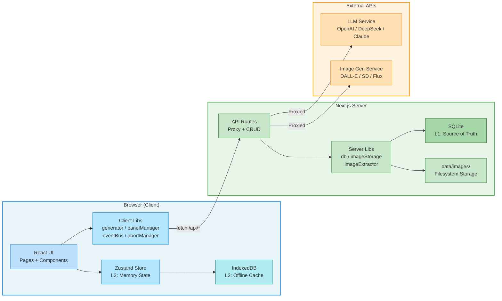
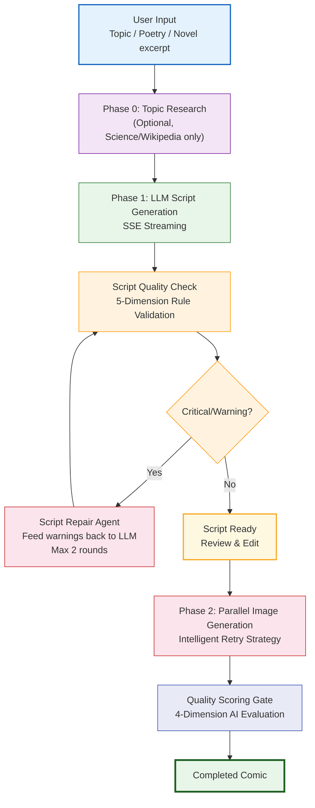

<p align="right">
  <a href="README.md">中文</a> | <b>English</b>
</p>

<p align="center">
  
</p>

<p align="center">
  <strong>AI-Powered Comic Generator</strong><br>
  Input any topic, get a fully illustrated comic strip — powered by LLM script writing and AI image generation.
</p>

<p align="center">
  
  
  
  
  
  
  
</p>

### Highlights

- **End-to-End Generation** — From topic input to finished comic, fully automated: LLM writes the storyboard + AI generates all panels
- **5 Content Types x 12 Art Styles** — Science / Wikipedia / Poetry / Novel / Xiaohongshu, combined with ink wash, pixel, chibi, and 9 more styles
- **Agent Quality Loop** — Script self-repair Agent + quality scoring gate + intelligent retry strategy — automatic error correction at key pipeline stages
- **Character Consistency** — Character library manages appearance descriptions and reference images, maintaining visual identity across panels
- **Zero-Dependency Deployment** — SQLite + IndexedDB, no external database needed, one-command Docker start

---

## Table of Contents

- [Project Status TODO](#project-status-todo)
- [Features](#features)
- [Tech Stack](#tech-stack)
- [Architecture](#architecture)
- [Quick Start](#quick-start)
  - [Prerequisites](#prerequisites)
  - [Local Development](#local-development)
  - [Docker Deployment](#docker-deployment)
  - [Configuration](#configuration)
- [Project Structure](#project-structure)
- [API Overview](#api-overview)
- [Content Types](#content-types)
- [Art Styles](#art-styles)
- [Data Storage](#data-storage)
- [Showcase](#showcase)
  - [Comic Works](#comic-works)
  - [Character Gallery](#character-gallery)
- [License](#license)

---

## Project Status TODO

### Done

- [x] Support 5 content types: science, Wikipedia, poetry, novel, and Xiaohongshu
- [x] Support 12 visual styles with style-specific prompt control
- [x] Support LLM storyboard generation with SSE streaming
- [x] Support script editing, per-panel regeneration, and panel version switching
- [x] Support character library, reference images, and cross-panel character consistency injection
- [x] Support VLM visual scoring, issue diagnosis, and one-click image repair
- [x] Support an enhanced pipeline of research -> outline -> script -> image -> review depending on quality tier
- [x] Support rule-based script validation, script self-repair agent, and intelligent retry strategy
- [x] Support automatic Wikipedia lookup and encyclopedia-style comic generation
- [x] Support PDF, ZIP, Markdown, and Seedance script export
- [x] Support trash, backup/restore, and IndexedDB -> SQLite migration
- [x] Support Docker deployment, health checks, and local SQLite persistence
- [x] Support Vitest unit tests and ESLint checks
- [x] Completed one repository-wide contamination cleanup and removed confirmed dead legacy types/files

### Todo / Next

- [ ] Add integration tests for key API routes (tasks / characters / series / config / backup)
- [ ] Add E2E tests for critical user flows (create script, generate images, export, restore)
- [ ] Build more systematic performance baselines and stress tests for large task volumes
- [ ] Improve background task observability and recovery tooling for long-running jobs
- [ ] Continue cleaning historical half-finished extension surfaces and redundant code so implementation stays aligned with documentation

---

## Features

### Content Generation

- **5 Content Types** — Science explainers, Wikipedia articles, classical Chinese poetry, novel adaptations, and Xiaohongshu-style posts
- **LLM Script Writing** — AI generates structured storyboard scripts with scene descriptions, dialogue, and image prompts
- **Streaming Output** — Real-time SSE streaming shows script generation as it happens
- **Wikipedia Integration** — Fetch and summarize Wikipedia articles, then transform them into illustrated comics

### AI Agent Pipeline

- **Script Self-Repair Agent** — After script generation, automatic quality validation (character consistency, composition variety, style alignment, language purity); detected issues are fed back to the LLM for correction, up to 2 repair rounds
- **Quality Scoring Gate** — After all images are generated, LLM auto-evaluates 4-dimension quality (knowledge accuracy, visual consistency, narrative coherence, composition diversity) with instant UI display
- **Intelligent Retry Strategy** — When image generation fails, selects targeted strategy based on error type: safety filter -> remove sensitive terms; prompt too long -> smart truncation; rate limit -> keep original and wait; default -> progressive simplification

### Image Generation

- **12 Art Styles** — Flat, anime, cartoon, chibi, manga, realistic, watercolor, sketch, ink wash, pixel, infographic, and banana
- **Any Image API** — Works with any OpenAI Images API-compatible service (DALL-E, Stable Diffusion, Flux, etc.)
- **Concurrent Generation** — Parallel image generation with adaptive concurrency control
- **Multi-Version Panels** — Regenerate individual panels and switch between version history
- **Reference Image Control** — ControlNet / img2img support for precise composition control

### Character Management

- **Character Library** — Define character appearances, reference images, and style variants
- **Cross-Panel Consistency** — Character descriptions automatically injected into image prompts
- **Character Presets** — Built-in presets for quick character creation
- **Wikipedia Import** — Import character info from Wikipedia

### Workflow & Export

- **Series Management** — Organize comics into serialized episodes
- **PDF / ZIP Export** — Download completed comics as PDF or ZIP archives
- **Backup & Restore** — Full data export/import with image preservation
- **Trash & Recovery** — Soft delete with recovery support
- **Dark Mode** — Full dark mode support via `next-themes`

### Deployment

- **Docker Ready** — Multi-stage Docker build, one command deployment
- **SQLite + IndexedDB** — Zero external database dependencies, offline-capable
- **Data Migration** — Built-in IndexedDB to SQLite migration tool
- **Health Check** — Built-in health check endpoint

---

## Tech Stack

| Layer | Technology | Purpose |
|-------|-----------|---------|
| Framework | **Next.js 15** (App Router) | Server-side rendering, API routes, file-based routing |
| UI | **React 19** + **Tailwind CSS 3** | Component UI with utility-first styling |
| Language | **TypeScript 5.7** (strict mode) | Type safety across the entire codebase |
| State | **Zustand** | Lightweight client-side state management |
| Database | **better-sqlite3** | Server-side persistent storage (source of truth) |
| Cache | **IndexedDB** (idb) | Client-side offline cache and high-frequency writes |
| Export | **jsPDF** + **JSZip** | PDF and ZIP export generation |
| Package Manager | **pnpm** | Fast, disk-efficient package management |

---

## Architecture

### Three-Layer State Architecture



### Agent-Enhanced Generation Pipeline



- **Phase 1** — LLM generates structured script -> rule-based validation -> auto-repair on issues (closed loop)
- **Phase 2** — Concurrent image generation -> intelligent retry (error-type-aware) -> quality scoring gate

---

## Quick Start

### Prerequisites

- **Node.js** >= 20 (LTS recommended)
- **pnpm** (recommended) or npm

### Local Development

```bash
# Clone the repository
git clone https://github.com/hechangia/ComicPedia.git
cd ComicPedia

# Install dependencies
pnpm install

# Start the development server
pnpm dev
```

Open [http://localhost:3000](http://localhost:3000) in your browser.

> **Note:** All runtime data (SQLite database, generated images) is stored in the `data/` folder at the project root, which is excluded by `.gitignore`. If you have previously run the project, old data (characters, tasks, etc.) in `data/` will NOT be removed by `git clone` or `git pull`. To start with a fresh database:
>
> ```bash
> pnpm clean   # Removes data/ directory; a fresh DB is created on next startup
> ```
>
> Also clear the site's IndexedDB in your browser (DevTools → Application → IndexedDB → delete `comicpedia`) to prevent stale data from syncing back to the server.

### Docker Deployment

```bash
# Copy the environment template
cp .env.docker.example .env

# Edit .env and fill in your API keys
# (see Configuration section below)

# Build and start
docker compose up -d

# Verify it's running
curl http://localhost:61323/api/health
```

**Docker details:**
- Default port: `61323`
- Data volume: `comicpedia-data` mounted to `/app/data` (SQLite + images)
- Memory limit: 1 GB
- Multi-stage build with standalone output

### Configuration

On first launch, navigate to the **Settings** page to configure your API providers:

| Setting | Description | Example |
|---------|-------------|---------|
| **LLM Provider** | Any OpenAI-compatible API or Anthropic | DeepSeek, GPT-4o, Claude |
| **Image Provider** | Any OpenAI Images API-compatible service | DALL-E 3, Stable Diffusion |

Supports multiple configuration profiles — switch between providers on the fly.

**Environment variables** (for Docker deployment):

| Variable | Description | Default |
|----------|-------------|---------|
| `PORT` | Server port | `61323` |
| `TEXT_API_URL` | LLM API endpoint | — |
| `TEXT_API_KEY` | LLM API key | — |
| `TEXT_MODEL` | LLM model name | `gpt-4o` |
| `IMAGE_API_URL` | Image generation endpoint | — |
| `IMAGE_API_KEY` | Image generation API key | — |
| `IMAGE_MODEL` | Image generation model | `gpt-4o` |
| `IMAGE_SIZE` | Generated image dimensions | `1024x1024` |
| `MAX_IMAGE_WORKERS` | Max concurrent image generation | `3` |

---

## Project Structure

```
src/
├── app/                        # Next.js App Router
│   ├── page.tsx                # Home (generation entry)
│   ├── create/                 # Create new comic
│   ├── result/[id]/            # Generation result viewer
│   ├── gallery/                # Comic gallery
│   ├── history/                # Generation history
│   ├── characters/             # Character library
│   ├── series/                 # Series management
│   ├── settings/               # API configuration
│   ├── trash/                  # Recycle bin
│   ├── poetry/                 # Poetry mode
│   ├── migrate/                # Data migration tool
│   └── api/                    # API endpoints
│       ├── llm/                # LLM proxy (non-streaming)
│       ├── llm-stream/         # LLM proxy (SSE streaming)
│       ├── image/              # Image generation proxy
│       ├── tasks/              # Task CRUD
│       ├── characters/         # Character CRUD
│       ├── series/             # Series CRUD
│       ├── backup/             # Export / Import
│       └── ...                 # health, config, trash, etc.
├── components/                 # React UI components
├── hooks/                      # Custom React hooks
├── lib/
│   ├── client/                 # Client-side runtime
│   │   ├── generator.ts        # Generation pipeline facade
│   │   ├── taskLifecycle.ts    # Task state machine + Agent loops
│   │   ├── panelManager.ts     # Panel image management
│   │   ├── promptEnhancer.ts   # 5-layer prompt enhancement
│   │   ├── db.ts               # IndexedDB operations
│   │   └── eventBus.ts         # Zustand notification bus
│   ├── server/                 # Server-side runtime
│   │   ├── db.ts               # SQLite schema & queries
│   │   ├── imageStorage.ts     # Image file management
│   │   └── imageExtractor.ts   # Base64 to file extraction
│   ├── scriptRepair.ts         # Script self-repair Agent
│   ├── scriptValidator.ts      # Script quality validation (pure rules)
│   ├── qualityScore.ts         # AI quality scoring
│   └── config/                 # Static configuration
│       ├── styles.ts           # 12 art style definitions
│       ├── quality.ts          # Quality presets
│       └── templates.ts        # Prompt templates
├── prompts/                    # LLM prompt templates
└── stores/
    └── taskStore.ts            # Zustand state store
```

---

## API Overview

### LLM & Image Proxy

| Route | Method | Description |
|-------|--------|-------------|
| `/api/llm` | POST | LLM request proxy (non-streaming) |
| `/api/llm-stream` | POST | LLM request proxy (SSE streaming) |
| `/api/image` | POST | Image generation proxy |
| `/api/proxy-image` | POST | External image download proxy |

### CRUD

| Route | Method | Description |
|-------|--------|-------------|
| `/api/tasks` | GET / POST | List / create tasks |
| `/api/tasks/[id]` | GET / DELETE | Get / delete a task |
| `/api/characters` | GET / POST | List / create characters |
| `/api/characters/[id]` | GET / PUT / DELETE | Get / update / delete a character |
| `/api/series` | GET / POST | List / create series |
| `/api/series/[id]` | GET / PUT / DELETE | Get / update / delete a series |
| `/api/trash` | GET / DELETE | List / empty trash |
| `/api/trash/[id]` | POST / DELETE | Restore / permanently delete |

### System

| Route | Method | Description |
|-------|--------|-------------|
| `/api/health` | GET | Health check |
| `/api/config` | GET / PUT | User config read/write |
| `/api/backup/export` | GET | Data export (`?strip_images=true` supported) |
| `/api/backup/import` | POST | Data import |
| `/api/save-image` | POST | Save base64 image to filesystem |
| `/api/images/[key]` | GET | Retrieve stored image by key |
| `/api/migrate` | POST | IndexedDB to SQLite migration |
| `/api/cleanup/images` | POST | Orphan image scan and cleanup |

---

## Content Types

| Type | Description | Recommended Styles |
|------|-------------|-------------------|
| **Science** | Science explainers and popular science topics | Flat, Infographic, Cartoon, Chibi |
| **Wikipedia** | Wikipedia article to illustrated comic | Flat, Infographic, Cartoon, Chibi |
| **Poetry** | Classical Chinese poetry visualization | Ink Wash, Watercolor, Sketch, Anime |
| **Novel** | Novel scene adaptation (e.g. Dream of the Red Chamber) | Manga, Realistic, Ink Wash, Watercolor |
| **Xiaohongshu** | Social media style illustrated posts | Infographic, Banana, Flat, Chibi |

---

## Art Styles

ComicPedia supports **12 distinct art styles**, each with tailored prompt modifiers and negative prompts:

| Style | Preview | Best For |
|-------|---------|----------|
| `flat` | Clean vector illustration | Science, Infographics |
| `anime` | Japanese anime style | Poetry, Characters |
| `cartoon` | Western cartoon | Science, Humor |
| `chibi` | Super-deformed cute style | Characters, Social |
| `manga` | Black & white manga | Novel, Action |
| `realistic` | Photorealistic rendering | Portraits, Scenes |
| `watercolor` | Soft watercolor painting | Poetry, Landscapes |
| `sketch` | Pencil sketch | Drafts, Concepts |
| `inkwash` | Traditional Chinese ink wash | Poetry, Classical |
| `pixel` | Retro pixel art | Tech, Gaming |
| `infographic` | Data visualization style | Science, Education |
| `banana` | Playful illustrated style | Social, Casual |

---

## Data Storage

| Storage | Layer | Purpose |
|---------|-------|---------|
| **SQLite** (`data/comicpedia.db`) | L1 — Source of Truth | Tasks, characters, series, config, image registry |
| **IndexedDB** | L2 — Client Cache | Offline fallback, high-frequency writes during generation |
| **Zustand** | L3 — Memory | Real-time UI state, event-driven updates |
| **Filesystem** (`data/images/`) | — | Extracted image files (base64 -> file) |

**Write path:** Client writes to IndexedDB first; terminal states (completed/failed) sync to SQLite.

**Read path:** Reads from SQLite API first; falls back to IndexedDB on failure.

---

## Showcase

### Comic Works

> All comics below are generated end-to-end by ComicPedia — from topic research, LLM script writing, to AI image generation.

#### AI Agent: The Self-Thinking Intelligence
> Science / Flat Style


---

#### The Nine-Layer Learning Tower
> Science / Infographic Style


---

#### OpenClaw: The AI Butler in Your Chat
> Science / Cartoon Style


---

#### Dragon Subduing Palm: Physics & Philosophy
> Wikipedia / Flat Style


---

#### Qingping Melody (Li Bai)
> Poetry / Ink Wash Style


---

#### Like a Dream (Li Qingzhao)
> Poetry / Watercolor Style


---

#### Granny Liu Visits the Grand View Garden
> Novel / Ink Wash Style


---

#### Daiyu Burying Flowers
> Novel / Watercolor Style


---

### Character Gallery

> ComicPedia's character library ensures visual consistency across panels. Each character can have multiple style variants — pixel art, chibi, ink wash, watercolor, and more.

#### 4-Variant Characters

<table>
  <tr>
    <th align="center">Lin Daiyu</th>
    <th align="center">Jia Baoyu</th>
  </tr>
  <tr>
    <td align="center">
      
      
      
      
    </td>
    <td align="center">
      
      
      
      
    </td>
  </tr>
</table>

<table>
  <tr>
    <th align="center">Xue Baochai</th>
    <th align="center">Wang Xifeng</th>
  </tr>
  <tr>
    <td align="center">
      
      
      
      
    </td>
    <td align="center">
      
      
      
      
    </td>
  </tr>
</table>

<table>
  <tr>
    <th align="center">Steve Jobs</th>
    <th align="center">Elon Musk</th>
  </tr>
  <tr>
    <td align="center">
      
      
      
      
    </td>
    <td align="center">
      
      
      
      
    </td>
  </tr>
</table>

<table>
  <tr>
    <th align="center">Sam Altman</th>
    <th align="center">Tux</th>
  </tr>
  <tr>
    <td align="center">
      
      
      
      
    </td>
    <td align="center">
      
      
      
      
    </td>
  </tr>
</table>

#### 3-Variant Characters

<table>
  <tr>
    <th align="center">Sun Wukong</th>
    <th align="center">Li Bai</th>
    <th align="center">Linus Torvalds</th>
  </tr>
  <tr>
    <td align="center">
      
      
      
    </td>
    <td align="center">
      
      
      
    </td>
    <td align="center">
      
      
      
    </td>
  </tr>
</table>

#### 2-Variant Characters

<table>
  <tr>
    <th align="center">Bill Gates</th>
    <th align="center">Alan Turing</th>
    <th align="center">OpenClaw</th>
  </tr>
  <tr>
    <td align="center">
      
      
    </td>
    <td align="center">
      
      
    </td>
    <td align="center">
      
      
    </td>
  </tr>
</table>

#### 5-Variant Characters

<table>
  <tr>
    <th align="center" colspan="5">Mao Zedong</th>
  </tr>
  <tr>
    <td align="center">
      
      
      
      
      
    </td>
  </tr>
</table>

---

## License

[MIT](LICENSE)
