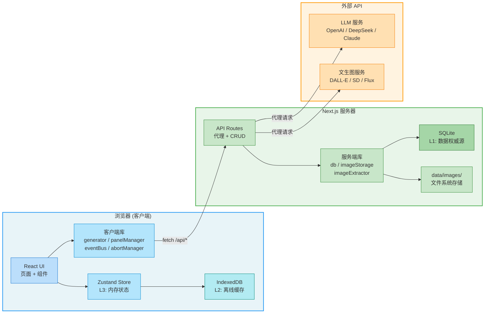
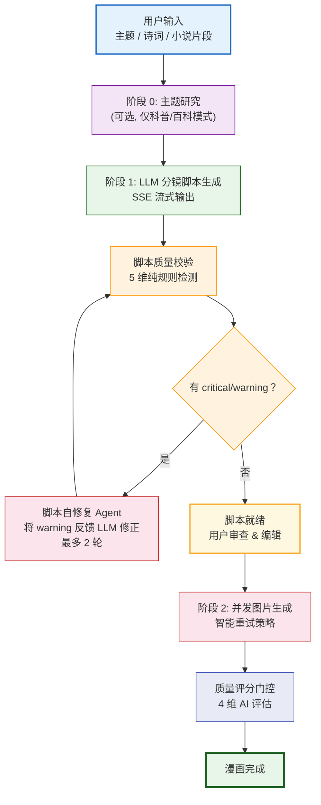

<p align="right">
  <b>中文</b> | <a href="README.en.md">English</a>
</p>

<p align="center">
  
</p>

<p align="center">
  <strong>AI 驱动的漫画生成器</strong><br>
  输入任意主题，自动生成完整漫画 — 由 LLM 编写分镜脚本，AI 批量生成画面。
</p>

<p align="center">
  
  
  
  
  
  
  
</p>

### Highlights

- **端到端生成** — 从主题输入到完整漫画，全程自动化：LLM 编写分镜脚本 + AI 批量生成画面
- **5 种内容 x 12 种画风** — 科普 / 百科 / 诗词 / 小说 / 小红书，搭配水墨、像素、Q 版等 12 种风格自由组合
- **Agent 质量闭环** — 脚本自修复 Agent + 质量评分门控 + 智能重试策略，在管线关键节点自动纠错
- **角色一致性** — 角色库管理外观描述与参考图，跨面板保持视觉统一
- **零依赖部署** — SQLite + IndexedDB，无需外部数据库，Docker 一键启动

## 生成流程（2026-04 编排升级）

- 阶段 1：服务端后台执行 Research / Script，页面关闭后仍会继续
- 阶段 2：脚本完成后默认不自动出图，结果页提供：
  - 生成本张
  - 生成选中
  - 继续剩余
- 本地 ComfyUI 默认先走校准图，再继续剩余队列
- 页面关闭时，当前出图会尽量完成并落盘，剩余队列自动暂停
- 轻量视觉检查自动执行；深度复审需要用户手动触发

---

## 目录

- [项目进度 TODO](#项目进度-todo)
- [功能特性](#功能特性)
- [技术栈](#技术栈)
- [系统架构](#系统架构)
- [快速开始](#快速开始)
  - [环境要求](#环境要求)
  - [本地开发](#本地开发)
  - [Docker 部署](#docker-部署)
  - [配置说明](#配置说明)
- [项目结构](#项目结构)
- [API 概览](#api-概览)
- [内容类型](#内容类型)
- [画面风格](#画面风格)
- [数据存储](#数据存储)
- [作品展示](#作品展示)
  - [漫画作品](#漫画作品)
  - [角色画廊](#角色画廊)
- [许可证](#许可证)

---

## 项目进度 TODO

### 已完成

- [x] 支持 5 种内容类型：科普、百科、诗词、小说、小红书
- [x] 支持 12 种画面风格与风格化 Prompt 控制
- [x] 支持 LLM 分镜脚本生成与 SSE 流式返回
- [x] 支持脚本编辑、单格重绘、多版本面板切换
- [x] 支持角色库、参考图、角色一致性注入
- [x] 支持 VLM 视觉评分、问题诊断与一键修复补图
- [x] 支持研究 → 大纲 → 脚本 → 图片 → 评审的增强生成管线（按质量档位启用）
- [x] 支持脚本规则校验、脚本自修复 Agent、智能重试策略
- [x] 支持 Wikipedia 自动检索与百科漫画生成
- [x] 支持 PDF、ZIP、Markdown、Seedance 脚本导出
- [x] 支持回收站、备份恢复、IndexedDB → SQLite 数据迁移
- [x] 支持 Docker 部署、健康检查与本地 SQLite 持久化
- [x] 支持 Vitest 单元测试与 ESLint 检查
- [x] 已完成一次仓库级污染清理，移除确认无引用的废弃类型与旧文件

### 待完成 / 可继续增强

- [ ] 为关键 API 路由补充集成测试（tasks / characters / series / config / backup）
- [ ] 为核心用户流程补充 E2E 测试（创建脚本、生成图片、导出、恢复）
- [ ] 补充更系统的性能基线与大列表/大任务量场景压测
- [ ] 增加更多后台任务可视化与失败恢复工具，降低长任务排障成本
- [ ] 继续清理仓库内历史遗留的半成品扩展面与冗余代码，保持实现与文档一致

---

## 功能特性

### 内容生成

- **5 种内容类型** — 科普文章、维基百科、古典诗词、小说改编、小红书图文
- **LLM 分镜编剧** — AI 自动生成结构化分镜脚本，包含场景描述、对白和画面提示词
- **流式输出** — 基于 SSE 的实时流式展示，脚本生成过程即时可见
- **维基百科集成** — 一键抓取维基百科文章，AI 润色后转化为图文漫画

### AI Agent 管线

- **脚本自修复 Agent** — 脚本生成后自动进行质量校验（角色一致性、构图多样性、风格对齐、语言纯净度），检测到问题自动反馈给 LLM 修正，最多 2 轮自动修复
- **质量评分门控** — 图片全部生成后自动调用 LLM 评估 4 维质量评分（知识准确性、视觉一致性、叙事连贯性、构图多样性），结果即时展示
- **智能重试策略** — 图片生成失败时根据错误类型选择针对性策略：安全过滤 → 移除敏感词；Prompt 过长 → 智能截断；速率限制 → 保持原 Prompt 等待；默认 → 渐进简化

### 图片生成

- **12 种画面风格** — 扁平插画、日系动漫、卡通、Q 版、漫画、写实、水彩、素描、水墨、像素、信息图、banana
- **兼容任意图片 API** — 支持任何 OpenAI Images API 兼容服务（DALL-E、Stable Diffusion、Flux 等）
- **并发生成** — 自适应并发控制，批量并行生成面板图片
- **多版本面板** — 支持单面板重新生成，可切换历史版本
- **参考图控制** — 支持 ControlNet / img2img 模式，精确控制画面构图

### 角色管理

- **角色库** — 定义角色外观描述、参考图片和风格变体
- **跨面板一致性** — 角色描述自动注入图片生成提示词
- **角色预设** — 内置常用角色预设，快速创建
- **维基百科导入** — 从维基百科导入角色信息

### 工作流与导出

- **连载管理** — 将漫画组织为连载系列
- **PDF / ZIP 导出** — 一键导出为 PDF 或 ZIP 格式
- **备份与恢复** — 完整的数据导入导出，包含图片
- **回收站** — 软删除机制，支持恢复
- **暗色模式** — 完整的深色主题支持

### 部署

- **Docker 一键部署** — 多阶段构建，一条命令启动
- **零外部数据库依赖** — SQLite + IndexedDB，无需额外数据库
- **数据迁移工具** — 内置 IndexedDB 到 SQLite 迁移
- **健康检查** — 内置健康检查端点

---

## 技术栈

| 层级 | 技术 | 职责 |
|------|------|------|
| 框架 | **Next.js 15** (App Router) | 服务端渲染、API 路由、文件系统路由 |
| 界面 | **React 19** + **Tailwind CSS 3** | 组件化 UI + 原子化 CSS |
| 语言 | **TypeScript 5.7** (strict mode) | 全栈类型安全 |
| 状态 | **Zustand** | 轻量客户端状态管理 |
| 数据库 | **better-sqlite3** | 服务端持久化存储（数据权威源） |
| 缓存 | **IndexedDB** (idb) | 客户端离线缓存 + 高频写入 |
| 导出 | **jsPDF** + **JSZip** | PDF 和 ZIP 导出生成 |
| 包管理 | **pnpm** | 高效磁盘利用的包管理器 |

---

## 系统架构

### 三层状态架构



### Agent 增强的生成管线



- **阶段 1** — LLM 生成结构化分镜脚本 → 纯规则校验 → 检测到问题自动修复（闭环）
- **阶段 2** — 图片并发生成 → 智能重试（根据错误类型选择策略） → 质量评分门控

---

## 快速开始

### 环境要求

- **Node.js** >= 20（推荐 LTS 版本）
- **pnpm**（推荐）或 npm

### 本地开发

```bash
# 克隆仓库
git clone https://github.com/hechangjia/ComicPedia.git
cd ComicPedia

# 安装依赖
pnpm install

# 启动开发服务器
pnpm dev
```

在浏览器中打开 [http://localhost:3000](http://localhost:3000)。

> **注意：** 所有运行时数据（SQLite 数据库、生成的图片）存储在项目根目录的 `data/` 文件夹中，该文件夹已被 `.gitignore` 排除。如果你之前运行过项目，`data/` 中的旧数据（角色、任务等）不会被 `git clone` 或 `git pull` 清除。如需全新数据库，请运行：
>
> ```bash
> pnpm clean   # 删除 data/ 目录，重启后自动创建空数据库
> ```
>
> 同时建议清除浏览器中对应站点的 IndexedDB 缓存（开发者工具 → Application → IndexedDB → 删除 `comicpedia` 数据库），避免旧数据从浏览器缓存回写到服务端。

### 质量检查与发版

```bash
# 本地质量检查
pnpm lint
pnpm test
pnpm build

# 发版前一键检查
pnpm ship:check
```

- `pnpm ship:check` 会顺序执行 `lint -> test -> build`，并阻止直接从默认基线分支发版
- GitHub Actions CI 会在 push / pull request 时运行同一套检查
- 推荐流程：在功能分支或 `dev` 上开发 -> 运行 `pnpm ship:check` -> push -> 创建指向 `master` 的 PR -> 合并前做关键页面冒烟测试
- 详细清单见 `docs/ai/ship.md`

### Docker 部署

```bash
# 复制环境变量模板
cp .env.docker.example .env

# 编辑 .env 填入你的 API Key
# （参见下方「配置说明」）

# 构建并启动
docker compose up -d
# 如果失败，建议运行以下命令
# docker compose up -d --build

# 验证运行状态
curl http://localhost:61323/api/health
```

**Docker 详情：**
- 默认端口：`61323`
- 数据卷：`comicpedia-data` 挂载到 `/app/data`（SQLite + 图片文件）
- 内存限制：2 GB（保底预留 512 MB）
- 多阶段构建 + standalone 输出模式

### 配置说明

首次启动后，进入**设置页面**配置 API 供应商：

| 配置项 | 说明 | 示例 |
|--------|------|------|
| **LLM 供应商** | 任意 OpenAI 兼容 API 或 Anthropic | DeepSeek、GPT-4o、Claude |
| **文生图供应商** | 任意 OpenAI Images API 兼容服务 | DALL-E 3、Stable Diffusion |

**可以先体验[魔力方舟](https://ai.gitee.com/serverless-api?model=z-image-turbo)每日提供的100次免费模型调用**


支持多套配置方案，可随时切换。

**环境变量**（Docker 部署时使用）：

| 变量 | 说明 | 默认值 |
|------|------|--------|
| `PORT` | 服务端口 | `61323` |
| `TEXT_API_URL` | LLM API 端点 | — |
| `TEXT_API_KEY` | LLM API 密钥 | — |
| `TEXT_MODEL` | LLM 模型名称 | `gpt-4o` |
| `IMAGE_API_URL` | 文生图 API 端点 | — |
| `IMAGE_API_KEY` | 文生图 API 密钥 | — |
| `IMAGE_MODEL` | 文生图模型名称 | `gpt-4o` |
| `IMAGE_SIZE` | 生成图片尺寸 | `1024x1024` |
| `MAX_IMAGE_WORKERS` | 最大并发生成数 | `3` |

---

## 项目结构

```
src/
├── app/                        # Next.js App Router
│   ├── page.tsx                # 首页（生成入口）
│   ├── create/                 # 创建新漫画
│   ├── result/[id]/            # 生成结果查看
│   ├── gallery/                # 漫画画廊
│   ├── history/                # 生成历史
│   ├── characters/             # 角色库
│   ├── series/                 # 连载系列
│   ├── settings/               # API 配置
│   ├── trash/                  # 回收站
│   ├── poetry/                 # 诗词模式
│   ├── migrate/                # 数据迁移工具
│   └── api/                    # API 端点
│       ├── llm/                # LLM 代理（非流式）
│       ├── llm-stream/         # LLM 代理（SSE 流式）
│       ├── image/              # 文生图代理
│       ├── tasks/              # 任务 CRUD
│       ├── characters/         # 角色 CRUD
│       ├── series/             # 连载 CRUD
│       ├── backup/             # 导入 / 导出
│       └── ...                 # health, config, trash 等
├── components/                 # React UI 组件
├── hooks/                      # 自定义 React Hooks
├── lib/
│   ├── client/                 # 客户端运行时
│   │   ├── generator.ts        # 生成管线门面
│   │   ├── taskLifecycle.ts    # 任务状态机 + Agent 闭环
│   │   ├── panelManager.ts     # 面板图片管理
│   │   ├── promptEnhancer.ts   # 5 层 Prompt 增强
│   │   ├── db.ts               # IndexedDB 操作
│   │   └── eventBus.ts         # Zustand 通知总线
│   ├── server/                 # 服务端运行时
│   │   ├── db.ts               # SQLite 表结构 & 查询
│   │   ├── imageStorage.ts     # 图片文件管理
│   │   └── imageExtractor.ts   # Base64 转文件提取
│   ├── scriptRepair.ts         # 脚本自修复 Agent
│   ├── scriptValidator.ts      # 脚本质量校验（纯规则）
│   ├── qualityScore.ts         # AI 质量评分
│   └── config/                 # 静态配置
│       ├── styles.ts           # 12 种画风定义
│       ├── quality.ts          # 质量预设
│       └── templates.ts        # Prompt 模板
├── prompts/                    # LLM Prompt 模板
└── stores/
    └── taskStore.ts            # Zustand 状态存储
```

---

## API 概览

### LLM 与图片代理

| 路由 | 方法 | 说明 |
|------|------|------|
| `/api/llm` | POST | LLM 请求代理（非流式） |
| `/api/llm-stream` | POST | LLM 请求代理（SSE 流式） |
| `/api/image` | POST | 文生图请求代理 |
| `/api/proxy-image` | POST | 外部图片下载代理 |

### CRUD

| 路由 | 方法 | 说明 |
|------|------|------|
| `/api/tasks` | GET / POST | 任务列表 / 创建任务 |
| `/api/tasks/[id]` | GET / DELETE | 获取 / 删除单个任务 |
| `/api/characters` | GET / POST | 角色列表 / 创建角色 |
| `/api/characters/[id]` | GET / PUT / DELETE | 获取 / 更新 / 删除角色 |
| `/api/series` | GET / POST | 连载列表 / 创建连载 |
| `/api/series/[id]` | GET / PUT / DELETE | 获取 / 更新 / 删除连载 |
| `/api/trash` | GET / DELETE | 回收站列表 / 清空 |
| `/api/trash/[id]` | POST / DELETE | 恢复 / 永久删除 |

### 系统

| 路由 | 方法 | 说明 |
|------|------|------|
| `/api/health` | GET | 健康检查 |
| `/api/config` | GET / PUT | 用户配置读写 |
| `/api/backup/export` | GET | 数据导出（支持 `?strip_images=true`） |
| `/api/backup/import` | POST | 数据导入 |
| `/api/save-image` | POST | 保存 base64 图片到文件系统 |
| `/api/images/[key]` | GET | 按 key 读取已存储的图片 |
| `/api/migrate` | POST | IndexedDB 到 SQLite 数据迁移 |
| `/api/cleanup/images` | POST | 孤儿图片扫描与清理 |

---

## 内容类型

| 类型 | 说明 | 推荐风格 |
|------|------|----------|
| **科普** | 科学知识普及文章 | 扁平插画、信息图、卡通、Q 版 |
| **百科** | 维基百科文章转漫画 | 扁平插画、信息图、卡通、Q 版 |
| **诗词** | 中国古典诗词可视化 | 水墨、水彩、素描、日系动漫 |
| **小说** | 小说场景改编（如《红楼梦》） | 漫画、写实、水墨、水彩 |
| **小红书** | 社交媒体风格图文帖 | 信息图、banana、扁平插画、Q 版 |

---

## 画面风格

ComicPedia 支持 **12 种**独特画面风格，每种风格都有专属的提示词修饰和负面提示词：

| 风格 | 说明 | 适用场景 |
|------|------|----------|
| `flat` | 简洁矢量插画 | 科普、信息图 |
| `anime` | 日系动漫风格 | 诗词、角色 |
| `cartoon` | 西方卡通风格 | 科普、幽默 |
| `chibi` | Q 版大头娃娃 | 角色、社交 |
| `manga` | 黑白漫画风格 | 小说、动作 |
| `realistic` | 写实渲染 | 肖像、场景 |
| `watercolor` | 柔和水彩画 | 诗词、风景 |
| `sketch` | 铅笔素描 | 草稿、概念 |
| `inkwash` | 中国传统水墨画 | 诗词、古典 |
| `pixel` | 复古像素风 | 科技、游戏 |
| `infographic` | 数据可视化风格 | 科普、教育 |
| `banana` | 趣味插画风格 | 社交、休闲 |

---

## 数据存储

| 存储 | 层级 | 职责 |
|------|------|------|
| **SQLite** (`data/comicpedia.db`) | L1 — 数据权威源 | 任务、角色、连载、配置、图片注册表 |
| **IndexedDB** | L2 — 客户端缓存 | 离线降级、生成过程高频写入 |
| **Zustand** | L3 — 内存状态 | 实时 UI 状态、事件驱动更新 |
| **文件系统** (`data/images/`) | — | 提取的图片文件（base64 -> 文件） |

**写入路径：** 客户端首先写入 IndexedDB；终态（completed/failed）同步到 SQLite。

**读取路径：** 优先读取 SQLite API；失败时降级到 IndexedDB。

---

## 作品展示

### 漫画作品

> 以下所有漫画均由 ComicPedia 端到端生成 — 从主题研究、LLM 分镜脚本编写，到 AI 图片批量生成，全自动完成。

#### AI Agent：会自己想、自己动的智能体
> 科普模式 / 扁平插画风格


---

#### 九层学习塔
> 科普模式 / 信息图风格


---

#### 消息框里的 AI 管家：OpenClaw
> 科普模式 / 卡通风格


---

#### 亢龙有悔：一掌背后的力学与哲学
> 百科模式 / 扁平插画风格


---

#### 清平调 · 其一（李白）
> 诗词模式 / 水墨风格


---

#### 如梦令 · 昨夜雨疏风骤（李清照）
> 诗词模式 / 水彩风格


---

#### 刘姥姥进大观园
> 小说模式 / 水墨风格


---

#### 落花照命：黛玉为何要葬花
> 小说模式 / 水彩风格


---

### 角色画廊

> ComicPedia 的角色库确保跨面板的视觉一致性。每个角色可以拥有多种风格变体 — 像素风、Q 版、水墨、水彩等，在不同风格的漫画中保持角色辨识度。

#### 4 变体角色

<table>
  <tr>
    <th align="center">林黛玉</th>
    <th align="center">贾宝玉</th>
  </tr>
  <tr>
    <td align="center">
      
      
      
      
    </td>
    <td align="center">
      
      
      
      
    </td>
  </tr>
</table>

<table>
  <tr>
    <th align="center">薛宝钗</th>
    <th align="center">王熙凤</th>
  </tr>
  <tr>
    <td align="center">
      
      
      
      
    </td>
    <td align="center">
      
      
      
      
    </td>
  </tr>
</table>

<table>
  <tr>
    <th align="center">史蒂夫 · 乔布斯</th>
    <th align="center">埃隆 · 马斯克</th>
  </tr>
  <tr>
    <td align="center">
      
      
      
      
    </td>
    <td align="center">
      
      
      
      
    </td>
  </tr>
</table>

<table>
  <tr>
    <th align="center">Sam Altman（奥特曼）</th>
    <th align="center">Tux（Linux 吉祥物）</th>
  </tr>
  <tr>
    <td align="center">
      
      
      
      
    </td>
    <td align="center">
      
      
      
      
    </td>
  </tr>
</table>

#### 3 变体角色

<table>
  <tr>
    <th align="center">孙悟空</th>
    <th align="center">李白</th>
    <th align="center">林纳斯 · 托瓦尔兹</th>
  </tr>
  <tr>
    <td align="center">
      
      
      
    </td>
    <td align="center">
      
      
      
    </td>
    <td align="center">
      
      
      
    </td>
  </tr>
</table>

#### 2 变体角色

<table>
  <tr>
    <th align="center">比尔 · 盖茨</th>
    <th align="center">艾伦 · 图灵</th>
    <th align="center">OpenClaw 小龙虾</th>
  </tr>
  <tr>
    <td align="center">
      
      
    </td>
    <td align="center">
      
      
    </td>
    <td align="center">
      
      
    </td>
  </tr>
</table>

#### 5 变体角色

<table>
  <tr>
    <th align="center" colspan="5">毛泽东</th>
  </tr>
  <tr>
    <td align="center">
      
      
      
      
      
    </td>
  </tr>
</table>

---

## 许可证

[MIT](LICENSE)
