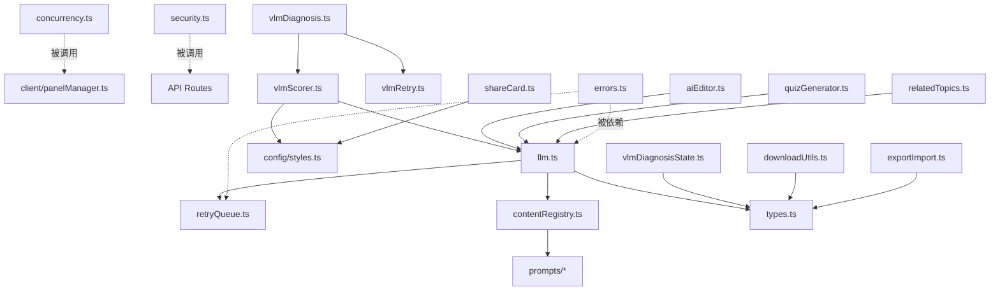

# src/lib/ 根目录 -- Core Utils (核心工具库)

> 生成时间: 2026-04-02 23:02:07

[根目录](../../CLAUDE.md) > [src](../) > [lib](.) > **Core Utils**

本文档覆盖 `src/lib/` 根目录下的核心工具模块（不含 quality agents、client/、server/、config/、accuracy/、vlm 系列）。

---

## 文件清单与职责

### 基础设施

| 文件 | 职责 | 关键导出 |
|------|------|----------|
| `types.ts` | 全项目类型定义 | `GenerateTask`, `ComicScript`, `ComicPanel`, `Character`, `Series`, `UserAPIConfigV2`, `ContentType`, `ComicStyle`, `VisualQualityScore`, `VisualDiagnosisReport` 等 |
| `errors.ts` | 统一错误体系 | `AppError` (code/severity/retryable), `toUserMessage()`, `isRetryableError()` |
| `llm.ts` | LLM 通用调用层 | `callLLM(prompt, overrides?)`, `callLLMStream(prompt, onChunk, overrides?)`, `generateScriptFromRegistry(contentType, params, onChunk?, overrides?)` |
| `concurrency.ts` | 并发控制器 | `withConcurrency(tasks, config)` -- 限制最大并发数，429 自适应降级 |
| `retryQueue.ts` | 指数退避重试 | `withRetry(fn, config?)`, `isRetryable(err)` |
| `security.ts` | 安全工具库 | `isUrlSafe(url)` (SSRF 防护), `sanitizeProxyError()`, `PROXY_TIMEOUT_MS`, `MAX_RESPONSE_BYTES` |
| `utils.ts` | 通用工具函数 | `clampScore()`, `extractJsonObject()`, `extractJsonArray()`, `urlToBase64()`, `createReferenceEntry()` |
| `contentRegistry.ts` | 内容类型注册表 | `getContentHandler(type)` -- 统一的 buildPrompt/parseResponse 路由 |

### 业务功能

| 文件 | 职责 | 关键导出 |
|------|------|----------|
| `series.ts` | 连载数据模型 | `Series`, `SeriesEpisode` 类型定义 |
| `aiEditor.ts` | AI 编辑助手 | `optimizeDialogue()`, `optimizeNarrative()` -- 通过 LLM 优化面板对话/叙事 |
| `shareCard.ts` | 分享卡片生成 | `generateShareCardBlob(script)` -- Canvas 绘制 1200x630 分享图 |
| `downloadUtils.ts` | 下载工具 | `getWatermarkText()`, `setWatermarkText()`, PDF/PNG/ZIP 导出相关画布工具 |
| `exportImport.ts` | ZIP 导入/导出 | 角色库和漫画历史的 ZIP 打包/解包（含图片），客户端运行 |
| `quizGenerator.ts` | 知识测验生成 | 根据漫画内容 + 难度等级（easy/medium/hard）通过 LLM 生成选择题 |
| `relatedTopics.ts` | 相关主题推荐 | 从漫画内容中通过 LLM 提取关联百科关键词 |
| `guideCharacterPolicy.ts` | 引导角色策略 | 检测/剥离 imagePrompt 中的引导角色描述（当用户选择禁用时） |

### VLM 视觉质量系列

| 文件 | 职责 | 关键导出 |
|------|------|----------|
| `vlmScorer.ts` | VLM 视觉评分 | `evaluateVisualQuality(script, overrides?)` -- 使用视觉语言模型评估图片质量 |
| `vlmRetry.ts` | VLM 反馈闭环 | `buildPromptPatch(issues)`, `applyPromptPatch(prompt, patch)`, `buildPanelReview()`, `buildTaskReviewStatus()` |
| `vlmDiagnosis.ts` | VLM 视觉诊断 | 第二轮深度诊断：逐面板分析问题 + 修复建议（patch/rewrite/manual） |
| `vlmDiagnosisState.ts` | 诊断状态机 | `markDiagnosisRunning/Succeeded/Failed/Skipped()`, `invalidateDiagnosis()` |

---

## 关键接口详解

### llm.ts

```typescript
// 非流式调用（通过 /api/llm 代理）
callLLM(prompt: string, overrides?: PartialLLMConfig): Promise<string>

// SSE 流式调用（通过 /api/llm-stream 代理）
callLLMStream(prompt: string, onChunk: StreamChunkCallback, overrides?: PartialLLMConfig): Promise<string>

// 内容注册表调用入口
generateScriptFromRegistry(contentType, params, onChunk?, overrides?): Promise<ComicScript>
```

自动路由：检测 `provider` 字段，分发到 OpenAI-compatible 或 Anthropic 协议。

### concurrency.ts

```typescript
withConcurrency<T>(
  tasks: (() => Promise<T>)[],
  config: { limit, signal?, throttledLimit?, throttleDuration? }
): Promise<PromiseSettledResult<T>[]>
```

429 自适应：检测到 Rate Limit 时暂停新任务启动 `throttleDuration` ms，已运行的 worker 继续执行。

### security.ts

```typescript
isUrlSafe(urlString: string): { safe: boolean; reason?: string }
```

策略：允许环回地址和私有网段（自托管场景），仅拦截云元数据端点 (169.254.169.254) 和数字编码 IP。

### contentRegistry.ts

```typescript
getContentHandler(type: ContentType): ContentTypeHandler | undefined

interface ContentTypeHandler {
  buildPrompt(params: ScriptGenerationParams): string;
  parseResponse(response: string): ComicScript | null;
}
```

已注册: science, poetry, xiaohongshu, novel, wikipedia

---

## 依赖关系总览



---

## 高风险区域

| 文件 | 风险等级 | 说明 |
|------|----------|------|
| `security.ts` | **高** | SSRF 防护逻辑，修改需谨慎审查 |
| `types.ts` | **高** | 全项目类型定义，修改 `GenerateTask` 或 `ComicScript` 会影响 DB 序列化、前端展示、VLM 评分等多个模块 |
| `llm.ts` | **中** | LLM 调用入口，URL 规范化逻辑（`/chat/completions` 自动拼接）有兼容性考虑 |
| `concurrency.ts` | **中** | 图片并发生成核心，429 降级逻辑影响生成速度和成功率 |
| `contentRegistry.ts` | **低** | 纯注册表，但新增内容类型必须在此注册 |

---

## 变更记录 (Changelog)

| 时间 | 说明 |
|------|------|
| 2026-04-02 | 首次生成模块文档 |
