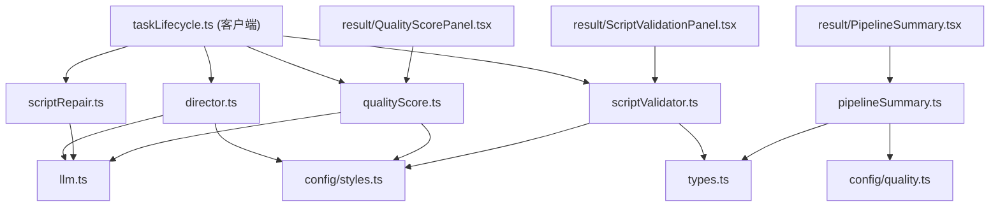

# src/lib/ 根目录 -- Quality Agents (导演/校验/修复/评分/摘要)

> 生成时间: 2026-04-02 23:02:07

[根目录](../../CLAUDE.md) > [src](../) > [lib](.) > **Quality Agents**

本文档覆盖 `src/lib/` 根目录下的质量保障相关模块。这些模块组成"生成管线质量层"，在脚本生成前后自动执行，零需用户手动触发。

---

## 模块职责总览

| 文件 | 角色 | 调用时机 | LLM 调用 | 职责 |
|------|------|----------|----------|------|
| `director.ts` | 导演 Agent | 脚本生成**前** | 1 次 (~300 token) | 生成叙事大纲（NarrativeOutline），约束创作方向 |
| `scriptValidator.ts` | 校验器 | 脚本生成**后** | 0 次 | 纯规则校验：角色漂移、构图重复、风格矛盾、语言混杂、叙事结构 |
| `scriptRepair.ts` | 修复 Agent | 校验不通过时 | 1 次 | 将结构化 warnings 反馈给 LLM 修正脚本 |
| `qualityScore.ts` | 文本评分 | 脚本完成后 | 1 次 | 4 维质量评估：知识/视觉一致性/叙事连贯/构图多样性 |
| `pipelineSummary.ts` | 摘要器 | 结果展示时 | 0 次 | 从 task 状态提取各阶段执行结果，供 UI 展示 |

---

## director.ts -- 导演 Agent

### 核心接口

```typescript
// 生成叙事大纲
generateNarrativeOutline(params: {
  topic: string;
  contentType?: ContentType;
  style: ComicStyle;
  panelCount?: number;
  researchContext?: string;
  llmOverrides?: PartialLLMConfig;
}): Promise<NarrativeOutline>

// 构建大纲指导文本（注入到脚本生成 prompt）
buildOutlineGuidance(outline: NarrativeOutline): string
```

### 叙事模板类型

| 模板 | 适用场景 | 自动推断规则 |
|------|----------|-------------|
| `mechanism` | 科学原理/技术机制 | 默认 |
| `mythic` | 神话传说/创世故事 | 关键词: 盘古、女娲、神话 |
| `discovery` | 科学发现/人物传记 | 关键词: 牛顿、爱因斯坦、发现 |
| `historical` | 历史事件/文明进程 | 关键词: 战争、革命、历史 |

### 大纲结构

```typescript
interface NarrativeOutline {
  templateType: NarrativeTemplateType;
  totalPanels: number;
  source?: "director" | "user";
  panels: Array<{
    beatRole: NarrativeBeatRole;      // hook | conflict | reveal | progression | closure
    shotIntent: NarrativeShotIntent;  // establish | hook-closeup | contrast | process | reveal | aftermath
    knowledgeGoal: string;
    carryForward: string;
  }>;
}
```

---

## scriptValidator.ts -- 脚本后校验器

### 核心接口

```typescript
validateScript(
  script: ComicScript,
  style: ComicStyle,
  context?: ScriptValidationContext
): ScriptValidation

interface ScriptValidation {
  passed: boolean;
  characterConsistency: boolean;
  compositionVariety: boolean;
  styleAlignment: boolean;
  languagePurity: boolean;
  warnings: ScriptWarning[];
}
```

### 校验维度

| 维度 | 检查内容 |
|------|----------|
| `character` | 角色描述锚点漂移（跨面板比较 characterDescription 关键词） |
| `composition` | 构图重复（连续面板使用相同镜头族：wide/medium/close-up/portrait 等） |
| `style` | 风格矛盾（imagePrompt 中的风格关键词是否与目标风格冲突） |
| `language` | CJK 字符混入 imagePrompt（禁止日文/韩文） |
| `narrative` | 叙事结构（hook 面板缺失强冲击、结尾面板缺少闭合等） |

---

## scriptRepair.ts -- 脚本自修复 Agent

### 核心接口

```typescript
repairScript(
  script: ComicScript,
  warnings: ScriptWarning[],
  llmOverrides?: PartialLLMConfig,
  context?: ScriptValidationContext
): Promise<ComicScript | null>
```

修复策略：
- 将 warnings 翻译为 LLM 可理解的修复指令
- 要求 LLM 仅修改受影响的面板，保留其他面板不变
- 最多执行 1 轮修复（由 `taskLifecycle` 控制 `scriptRepairRounds` 计数器）

---

## qualityScore.ts -- 文本质量评分

### 核心接口

```typescript
evaluateQualityScore(
  script: ComicScript,
  llmOverrides?: PartialLLMConfig
): Promise<QualityScore>

interface QualityScore {
  overall: number;              // 1-10 综合分
  knowledge: number;            // 知识准确性
  visualConsistency: number;    // 视觉一致性
  narrativeCoherence: number;   // 叙事连贯性
  compositionDiversity: number; // 构图多样性
  suggestions: string[];        // 改进建议
}
```

---

## pipelineSummary.ts -- 管线摘要

### 核心接口

```typescript
getPipelinePhases(task: GenerateTask): PhaseInfo[]

interface PhaseInfo {
  name: string;                          // 阶段名称（中文）
  status: "done" | "skipped" | "failed"; // 执行状态
  detail?: string;                       // 详情描述
}
```

摘要阶段：主题研究 -> 准确性研究 -> 叙事大纲 -> 脚本生成 -> 脚本校验 -> 脚本修复 -> 图片生成 -> 文本评分 -> VLM 视觉评分 -> VLM 视觉重试

---

## 依赖关系



---

## 执行顺序

```
[fast 模式] 跳过所有 quality agents，直接生成脚本 + 图片

[standard/meticulous 模式]
  1. director.generateNarrativeOutline()  → NarrativeOutline
  2. contentHandler.buildPrompt()         → 脚本生成（注入大纲）
  3. scriptValidator.validateScript()      → ScriptValidation
  4. 如有 critical/warning:
     scriptRepair.repairScript()          → 修复后脚本
     scriptValidator.validateScript()     → 再次校验
  5. 图片生成（并发）
  6. qualityScore.evaluateQualityScore()  → QualityScore
  7. [meticulous] VLM 视觉评分 + 自动重试
```

---

## 变更记录 (Changelog)

| 时间 | 说明 |
|------|------|
| 2026-04-02 | 首次生成模块文档 |
